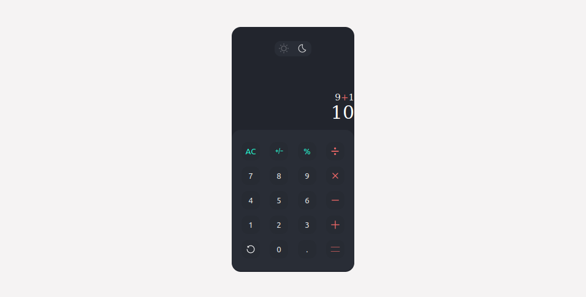

<!-- PROJECT LOGO -->
 

  
   
  <h3 align="center">CALCULATOR</h3>
  

    <a href="https://github.com/O-Mike25/Calculator">View Demo</a>
  

<!-- TABLE OF CONTENTS -->
## Table of Contents

* [About the Project](#about-the-project)
  * [Built With](#built-with)
* [Getting Started](#getting-started)
  * [Prerequisites](#prerequisites)
* [Usage](#usage)
* [Contact](#contact)

<!-- ABOUT THE PROJECT -->
## About The Project

[Calculator-screenshot] 

This is a simple calculator that can help you do some basic calculation. Depending on your preferences you can view it in light or dark mode .

### Built With
* [HTML]
* [Javascript]
* [CSS]

<!-- GETTING STARTED -->
## Getting Started

### Prerequisites

This calculator use mathJS library in background to process the operations of the user , so you need to be connected to internet to use it.

<!-- USAGE EXAMPLES -->
## Usage

You just need to load the index.html file in your browser.

<!-- CONTACT -->
## Contact

Mike ODJO odjomike25@gmail.com

